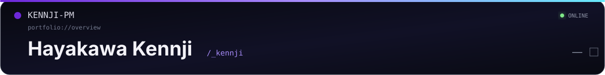
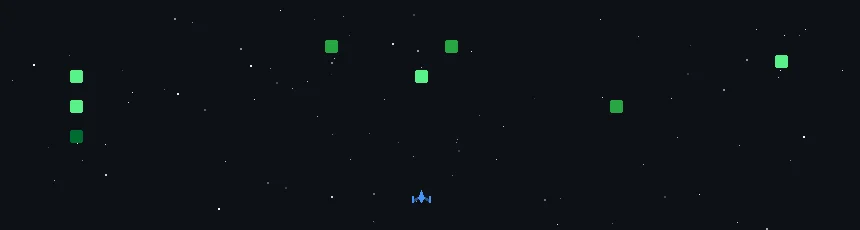

<!--
  _kennji / GitHub Profile
-->

<div align="center">



<p>
  <code>minecraft systems</code>
  <code>automation</code>
  <code>desktop interfaces</code>
</p>

<p>
  <a href="https://github.com/Kennji-pm">
    
  </a>
  <a href="https://m.facebook.com/KennjiPM">
    
  </a>
  
  
</p>

<p>
  <a href="#overview"><code>OVERVIEW</code></a>
  &nbsp;/&nbsp;
  <a href="#projects"><code>PROJECTS</code></a>
  &nbsp;/&nbsp;
  <a href="#signal"><code>SIGNAL</code></a>
  &nbsp;/&nbsp;
  <a href="#bootdev"><code>BOOT.DEV</code></a>
  &nbsp;/&nbsp;
  <a href="#terminal"><code>TERMINAL</code></a>
</p>

</div>

<br>

<table width="100%">
<tr>
<td>
  <strong>KENNJI-PM STUDIO</strong>
  <sub>&nbsp;/&nbsp; profile.session</sub>
</td>
<td align="right">
  <code>ONLINE</code>
  &nbsp;
  <kbd>—</kbd>
  <kbd>□</kbd>
  <kbd>×</kbd>
</td>
</tr>
</table>

<a id="overview"></a>

## <samp>01 / OVERVIEW</samp>

<table width="100%">
<tr>
<td width="62%" valign="top">

### Hayakawa Kennji

Independent developer from Vietnam.

Most of my work sits in three areas: **Minecraft server systems**, **automation**, and **desktop interfaces**. I prefer small, explicit architectures over framework-heavy code, and I care about runtime behavior just as much as feature count.

<br>

| DOMAIN | CURRENT TOOLING |
|---|---|
| Minecraft systems | Java · Paper / Spigot ecosystem |
| Automation | Python · JavaScript · Node.js |
| Desktop | Rainmeter · Windows tooling |
| Workflow | Git · GitHub · VS Code · Arch Linux |

</td>
<td width="38%" valign="top">

```text
PROFILE
-------
handle      _kennji
location    Vietnam
work        independent
primary     Python
secondary   Java / JavaScript / Rust / C++

state       BUILDING
```

</td>
</tr>
</table>

<br>

<a id="projects"></a>

<details open>
<summary><strong><code>02 / PROJECTS</code></strong> &nbsp; selected work</summary>

<br>

<table width="100%">
<tr>
<td width="33%" valign="top">

### [NightfallAutoQuest](https://github.com/Kennji-pm/NightfallAutoQuest)

Minecraft quest-system work focused on server-side gameplay logic and plugin architecture.

`JAVA` `MINECRAFT`

[repository →](https://github.com/Kennji-pm/NightfallAutoQuest)

</td>
<td width="33%" valign="top">

### [StarlightAbsolute-Bot](https://github.com/Kennji-pm/StarlightAbsolute-Bot)

Discord automation project and bot tooling.

`JAVASCRIPT` `DISCORD`

[repository →](https://github.com/Kennji-pm/StarlightAbsolute-Bot)

</td>
<td width="33%" valign="top">

### [PearlUI_Rainmeter](https://github.com/Kennji-pm/PearlUI_Rainmeter)

Rainmeter desktop interface experiments for Windows.

`RAINMETER` `DESKTOP`

[repository →](https://github.com/Kennji-pm/PearlUI_Rainmeter)

</td>
</tr>
</table>

<br>

<div align="center">

<a href="https://github.com/Kennji-pm?tab=repositories">
  
</a>

</div>

<br>
</details>

<br>

<a id="signal"></a>

<details open>
<summary><strong><code>03 / SIGNAL</code></strong> &nbsp; live GitHub telemetry</summary>

<br>

<div align="center">

<table>
<tr>
<td align="center" width="50%">

</td>
<td align="center" width="50%">

</td>
</tr>
</table>

<br>


<br><br>

<a href="https://github.com/Kennji-pm">
  
</a>

</div>

<br>
</details>

<br>

<a id="bootdev"></a>

<details open>
<summary><strong><code>04 / BOOT.DEV</code></strong> &nbsp; learning feed</summary>

<br>

<div align="center">


</div>

<br>
</details>

<br>

<a id="terminal"></a>

<details open>
<summary><strong><code>~/terminal</code></strong> &nbsp; <code>kennji@studio:~</code></summary>

<br>

```console
kennji@studio:~$ whoami
Hayakawa Kennji
handle      _kennji
location    Vietnam
work        independent developer

kennji@studio:~$ pwd
/home/kennji/workspace

kennji@studio:~$ ls
automation/  desktop/  experiments/  minecraft/

kennji@studio:~$ tree -L 2
.
├── automation
│   ├── discord
│   └── tooling
├── desktop
│   └── rainmeter
├── experiments
└── minecraft
    ├── gameplay-systems
    ├── plugins
    └── server-tooling

kennji@studio:~$ git status --short
 M minecraft/
 M automation/
 M desktop/
?? experiments/

kennji@studio:~$ printf '%s\n' "$STATE"
BUILDING

kennji@studio:~$ _
```

</details>

<br>

<details>
<summary><strong><code>05 / ENVIRONMENT</code></strong> &nbsp; tools and runtime</summary>

<br>

<div align="center">


<br><br>

<code>Java</code>
&nbsp;
<code>Python</code>
&nbsp;
<code>JavaScript</code>
&nbsp;
<code>Node.js</code>
&nbsp;
<code>Git</code>
&nbsp;
<code>GitHub</code>
&nbsp;
<code>VS Code</code>
&nbsp;
<code>Arch Linux</code>

</div>

<br>
</details>

<br>

<table width="100%">
<tr>
<td>
  <code>KENNJI-PM STUDIO / EOF</code>
</td>
<td align="right">
  <a href="https://github.com/Kennji-pm">github.com/Kennji-pm</a>
</td>
</tr>
</table>
